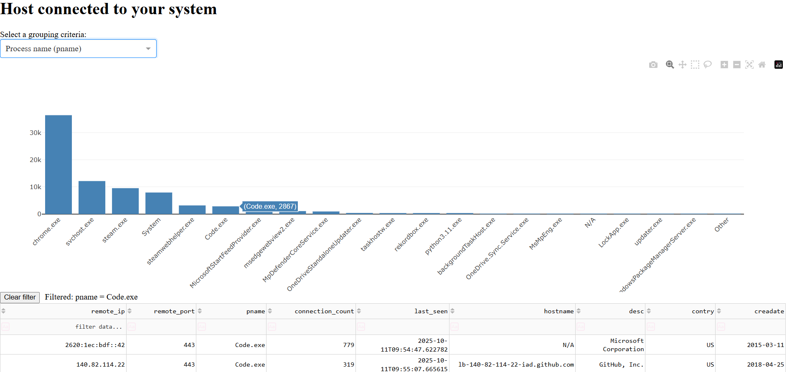

# Tools for ip connection inspection

Watch the process and the hosts connected to your machine:



List and aggregate by process name, ip/hostname, country and whois description

## Install

You need to create a virtual env, called for example 'venv'.
For example at the root of the repo:
`python -m venv ./venv `

Activate it :
`source ./venv/bin/activate`
or
`.\venv\Scripts\activate`

You need to install in this venv some modules

```
pip install dash
pip install psutil
pip install pandas
pip install ipwhois
```

## Run
`python ./analyseConn.py`

or use the launcher. You need in the launcher to set your venv location ! 

### Possible issue

On windows, to activate your venv or use the lancher script, You may need to activate PS scripts : 
`Set-ExecutionPolicy -ExecutionPolicy Unrestricted`
See : 
https://learn.microsoft.com/fr-fr/powershell/module/microsoft.powershell.core/about/about_execution_policies?view=powershell-7.5


Limitation : the stats are based on the number of time the host was seen connected, not on the data volume (number of packet) that would require packet capture and elevation of privilege (root/admin)
